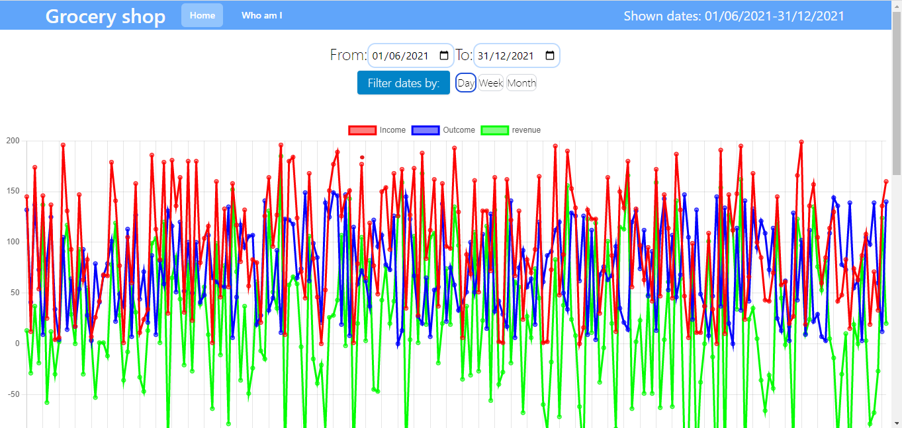
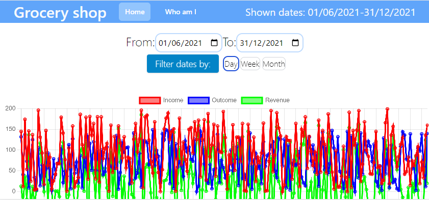

# Sisense Grocery Mangement Client Repo

## What this repo stands for

Welcome to grocery mangement Client Readme, this app can manage your incomes, outcomes and revenue.
You are able to see all of your data sorted per day, week or month.
In addition you can choose which line in the graph you prefer to watch, whether it is one two or all three.

## Features

1. See all your data sorted by day.
2. **(Extra)** The app is fully mobile supproted.
3. **(Extra)** See all your data sorted weekly or monthly.
4. **(Extra)** Choose which graph you prefer to watch.

## Technologies

The technoloies I chose to use are:

1. React.JS.
2. Chart.JS.
3. ESLint
4. TailwindCSS

## Instructions

1. Fork this repo into your account.
2. Clone the forked repo to your computer.
3. Run `npm install`.
4. Run the server side.
5. Run `npm run start` for start recicve requsets on client environment.

## Screenshots

### Regular screen - Dates 1/6/2021-31/12/2021 sorted by day

### Regular screen - Dates 1/6/2021-31/12/2021 sorted by Month

### Regular screen - Dates 1/6/2021-31/12/2021 only incomes and revenue shown

### Mobile screen - Vertical screen will not show any data

### Mobile screen - Dates 1/6/2021-31/12/2021 sorted by day

### Mobile screen - Dates 1/6/2021-31/12/2021 sorted by Month

### Mobile screen - Dates 1/6/2021-31/12/2021 only incomes and outcome shown

